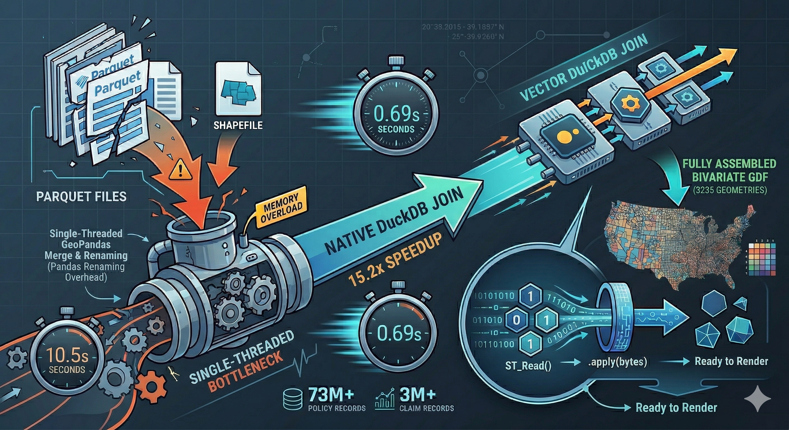

> ### ⚡ TL;DR
> * **The Task:** Map 73M+ FEMA NFIP policy records and 3M+ claims (since 1978) to U.S. county boundaries  
> * **The Bottleneck:** A Pandas/GeoPandas pipeline that took 10.5s and consumed significant memory  
> * **The Fix:** A single DuckDB SQL query using the `spatial` extension  
> * **The Result:** **0.69 seconds (15.2x faster)**  

This post walks through how I optimized a real-world FEMA geospatial pipeline using DuckDB and why it significantly outperforms Pandas for large-scale spatial joins.



---

In geospatial data workflows, *waiting* often feels like part of the job.

Kick off a heavy join.  
Watch the kernel spin.  
Maybe grab a coffee—and hope nothing crashes.

While analyzing FEMA’s National Flood Insurance Program (NFIP) dataset—spanning nearly 50 years of flood insurance data across the United States—I hit exactly that wall.

I needed to:

- Aggregate **2.7 million claims**
- Combine **72.5 million policies**
- Map everything to **U.S. county shapefiles (Census TIGER/Line)**

Normally, I’d reach for Pandas + GeoPandas without thinking twice.

This time, I didn’t.

Instead, I pushed everything into **DuckDB**—and it changed everything.

## 📊 The Benchmark

I ran a strict head-to-head comparison:

- Timer starts before reading data  
- Timer stops after the final GeoDataFrame is ready  
- Pandas version fully optimized (column pruning, memory cleanup)

```{r, echo=FALSE}
library(knitr)
library(kableExtra)

df <- data.frame(
  Metric = c("Execution Time", "Speedup"),
  `Pandas Pipeline` = c("10.49 seconds", "1.0x"),
  `Native DuckDB Pipeline` = c("0.69 seconds", "15.2x faster")
)

kable(df, align = "c", booktabs = FALSE) %>%
  kable_styling(
    full_width = TRUE,
    position = "center",
    font_size = 16
  ) %>%
  row_spec(0, bold = TRUE, extra_css = "border-bottom: 2px solid black;") %>%
  row_spec(1:nrow(df), extra_css = "border-bottom: 1px solid #ddd;") %>%
  column_spec(1, width = "200px", extra_css = "border-right: 2px solid black;") %>%
  column_spec(2, width = "200px", extra_css = "border-right: 1px solid #ccc;") %>%
  column_spec(3, width = "200px")

# kable_styling(full_width = TRUE, bootstrap_options = c("hover"))
```


Even with careful tuning, Pandas just couldn’t keep up.

## The "Before": Pandas Bottleneck

Here’s what the typical workflow looked like:


```{python, eval = FALSE}
import duckdb
import pandas as pd
import geopandas as gpd

# 1. Read files into RAM
con = duckdb.connect()
claims_df = con.execute("""
    SELECT countyCode, netBuildingPaymentAmount 
    FROM read_parquet('../data/FimaNfipClaimsV2.parquet')
""").df()

policies_df = con.execute("""
    SELECT countyCode, policyCount, totalBuildingInsuranceCoverage 
    FROM read_parquet('../data/FimaNfipPoliciesV2.parquet')
""").df()
con.close()

# 2. Aggregate millions of rows (Single-threaded)
claims_agg = (claims_df.dropna(subset=['countyCode'])
              .groupby('countyCode')
              .agg(avg_claim_amt=('netBuildingPaymentAmount', 'sum'))
              .reset_index())

policies_agg = (policies_df.dropna(subset=['countyCode'])
                .groupby('countyCode')
                .agg(total_policies=('policyCount', 'sum'), 
                     avg_coverage=('totalBuildingInsuranceCoverage', 'sum'))
                .reset_index())

# 3. Clean and Join
agg_df = pd.merge(claims_agg, policies_agg, on='countyCode', how='outer')
agg_df = agg_df.rename(columns={'countyCode': 'GEOID'})
agg_df['GEOID'] = agg_df['GEOID'].astype(str).str.zfill(5)

# 4. Spatial Merge
counties = gpd.read_file('../data/tl_2025_us_county/tl_2025_us_county.shp')
counties = counties[['GEOID', 'STATEFP', 'geometry']]
merged_gdf = counties.merge(agg_df, on='GEOID', how='left')
```

### What’s going wrong?

- Millions of rows pulled into memory  
- Single-threaded `groupby` operations  
- Manual column cleanup  
- GeoPandas doing joins in Python  

It works—but it doesn’t scale.


## The "After": All-in-DuckDB

Instead of bouncing between tools, I let DuckDB handle everything:


```{python, eval = FALSE}
import duckdb
import pandas as pd
import geopandas as gpd

def load_and_join_all_in_duckdb():
    con = duckdb.connect()
    con.execute("INSTALL spatial; LOAD spatial;")
    
    # Unified SQL query for aggregation and spatial join
    query = """
    WITH aggregated_claims AS (
        SELECT 
            lpad(cast(countyCode AS VARCHAR), 5, '0') AS GEOID,
            sum(netBuildingPaymentAmount)             AS avg_claim_amt
        FROM read_parquet('../data/FimaNfipClaimsV2.parquet')
        WHERE countyCode IS NOT NULL
        GROUP BY 1
    ),
    aggregated_policies AS (
        SELECT 
            lpad(cast(countyCode AS VARCHAR), 5, '0') AS GEOID,
            sum(policyCount)                          AS total_policies,
            sum(totalBuildingInsuranceCoverage)       AS avg_coverage
        FROM read_parquet('../data/FimaNfipPoliciesV2.parquet')
        WHERE countyCode IS NOT NULL
        GROUP BY 1
    ),
    counties_shapefile AS (
        SELECT 
            GEOID, 
            STATEFP,
            ST_AsWKB(geom) AS geometry 
        FROM ST_Read('../data/tl_2025_us_county/tl_2025_us_county.shp')
    )
    SELECT 
        s.GEOID, s.STATEFP, p.total_policies, 
        p.avg_coverage, c.avg_claim_amt, s.geometry
    FROM counties_shapefile s
    LEFT JOIN aggregated_policies p ON s.GEOID = p.GEOID
    LEFT JOIN aggregated_claims c   ON s.GEOID = c.GEOID
    """
    
    df = con.execute(query).df()
    con.close()
    
    # Cast bytearray to strict bytes for Shapely compatibility
    df['geometry'] = df['geometry'].apply(bytes)
    
    # Final Handoff to GeoPandas
    df['geometry'] = gpd.GeoSeries.from_wkb(df['geometry'])
    return gpd.GeoDataFrame(df, geometry='geometry', crs="EPSG:4269")

if __name__ == "__main__":
    gdf = load_and_join_all_in_duckdb()
```

##  What Changed (And Why It Matters)

The speedup wasn’t just about switching tools—it came from changing *where* the work happens.

### 1. No Python Overhead
The biggest win? The raw datasets never enter Python memory.

Instead of pulling tens of millions of rows into Pandas, DuckDB does all the heavy lifting internally—and only returns the final, compact result.

---

### 2. Native Spatial + SQL Execution
Everything runs in one place:

- Aggregations happen in SQL  
- Joins happen in SQL  
- Even shapefiles are read directly with `ST_Read()`  

No handoffs. No intermediate DataFrames. No extra overhead.

---

### 3. A Cleaner Data Model
Because everything is defined in a single SQL query:

- No column duplication  
- No more `left_on` / `right_on` gymnastics during joins  
- No post-merge cleanup  

What you select is exactly what you get.

---

### 4. Fast Geometry Transfer (The WKB Trick)
Geospatial data is usually expensive to move around.

Instead of passing full geometry objects, DuckDB serializes them as **WKB (Well-Known Binary)**:

- DuckDB → sends compact binary  
- GeoPandas → reconstructs geometry instantly  

This makes the Python handoff surprisingly fast.

---

### ⚠️ Small Gotcha

DuckDB returns geometry as a `bytearray`, but GeoPandas expects `bytes`. Easy fix—but easy to miss. A simple fix:

```{python, eval = FALSE}
df['geometry'] = df['geometry'].apply(bytes)
```


## 💡 The Takeaway

Moving your join logic out of Pandas and into native SQL is one of the highest-ROI changes you can make for large geospatial datasets. It ensures clean data filtering at the source and provides a massive performance leap. You’ll get:

- ⚡ Faster execution
- 🧠 Lower memory usage
- 🧹 Cleaner, more maintainable code
- 📈 Better scalability as your data grows

And honestly… fewer coffee breaks waiting for your code to finish ☕