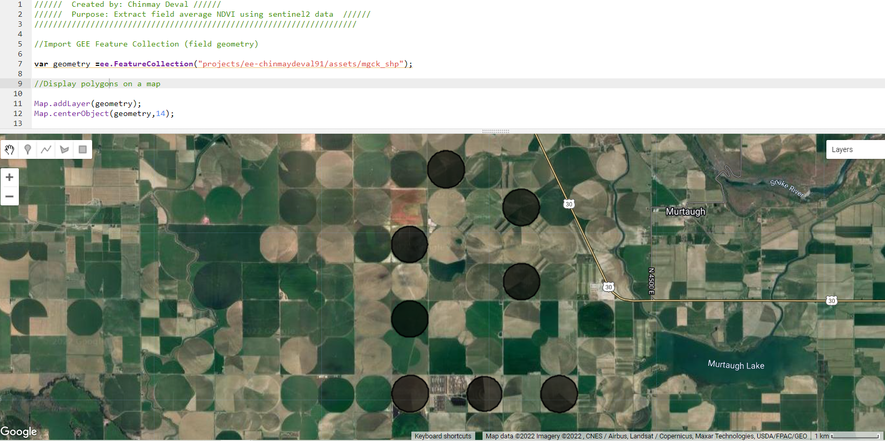

```{js setup, include=FALSE}
knitr::opts_chunk$set(echo = TRUE)
```

```{r xaringanExtra-clipboard, echo=FALSE}
xaringanExtra::use_clipboard()
```

## TL;DR
- Add your Shapefile to Assets
- Use Google Earth Engine's JavaScript API  
- Create a Normalized Difference Vegetation Index (NDVI) from Sentinel data
- Extract and visualize time series in the Earth Engine code editor console 
- Extract and export a large time-series data to a CSV


When working with geospatial data we are often interested in extracting time series for a set of locations. These, for instance, could be several points or polygons representing different locations. In this short blog, we will use JavaScript in Google Earth Engine's code editor and extract time series over a set of polygons. We will use Sentinel-2 data to extract the Normalized Difference Vegetation Index (NDVI) for a set of irrigated fields. Let's begin by bringing our polygon data to the google earth engine. 

### Adding polygon shapefile to assets

To upload a shapefile as an asset on Google Earth Engine, navigate to `Assets` in the left sidebar, click `New`, and select `Shapefiles` in the drop-down. A window to upload the shapefile will pop up as shown in the screenshot below. 


`Select` the file from your computer to be uploaded and click upload. In this case, the file is called `mgck_shp.zip`. You will be able to see the upload progress in the `Tasks` sidebar on the right (see screenshot below) and when the upload is complete the shapefile will appear under the `CLOUD ASSETS` on the left sidebar (highlighted in yellow in this case).


### Import and visualize FeatureCollection

The shapefile that was just added to the Assets can be loaded and displayed on the map using the following code chunk:

```{js}
//Import GEE Feature Collection (field geometry)

var geometry =ee.FeatureCollection("projects/ee-chinmaydeval91/assets/mgck_shp");

//Display polygons on a map

Map.addLayer(geometry);
Map.centerObject(geometry,14);
```

This displays on the map eight irrigated agriculture fields in the Magic Valley, Idaho.



### Create and extract Sentinel NDVI

Unlike MODIS NDVI composite products, to my knowledge, there is no such pre-computed NDVI product for Sentinel on GEE. So we will have to create the NDVI first. 

#### Import image collection

Let's start by importing the Sentinel-2 surface reflectance image collection by typing the following code:

```{js}
// Import image collection of Sentinel-2 imagery, and
// filter by start and end date, and
// filter by boundary extent

var S2 = ee.ImageCollection('COPERNICUS/S2')
.filterDate('2019-03-28', '2021-12-31')
.filterBounds(geometry);
```

This imports the Sentinel-2 collections and filters them for the given date range as well as the bounds of the feature collection. Next, we need to mask out the cloudy and snowy images.

#### Mask Clouds and Snow

I came across this `maskS2sr` function on [UN Spider's Burn Severity mapping tutorial](https://un-spider.org/sites/default/files/Code_GEE_burn_sev.txt) that is written to mask out clouds and snow. I will be using it here:

```{js}
// Function to mask clouds from the pixel quality band of Sentinel-2 SR data. 

function maskS2sr(image) {
  // Bits 10 and 11 are clouds and cirrus, respectively.
  var cloudBitMask = ee.Number(2).pow(10).int();
  var cirrusBitMask = ee.Number(2).pow(11).int();
  // Get the pixel QA band.
  var qa = image.select('QA60');
  // All flags should be set to zero, indicating clear conditions.
  var mask = qa.bitwiseAnd(cloudBitMask).eq(0)
      .and(qa.bitwiseAnd(cirrusBitMask).eq(0));
  // Return the masked image, scaled to TOA reflectance, without the QA bands.
  return image.updateMask(mask)
      .copyProperties(image, ["system:time_start"]);
}

// mask clouds and snow across the image collection
var S2 = S2.map(maskS2sr)
```

Now we have the Sentinel-2 image collection that is cloud and snow-free and is filtered for the given spatial and temporal bounds. We can even clip the image collection to these irrigated fields.

#### Clip to irrigated field polygons

To clip the image by polygon we can use the following `clipImgCollect` function and then `map` it across the entire image collection:

```{js}
////// function to clip the entire ImageCollection to the field boundary //////
function clipImgCollect(img) {
  return img.clip(geometry);
}

// clip S2 ImageCollection to poly bounds
var clippedS2 = S2.map(clipImgCollect);

```


#### Calculate NDVI

Now, to the final step before visualization - calculating NDVI. This can be done using the `NDVI_from_S2` function below that perform the band math calculations. We can then `map` this function to the entire image collection:

```{js}
// Function to calculate and create NDVI
var NDVI_from_S2 = function(img) {
return img.addBands(img.normalizedDifference(['B8', 'B4']));
};

// map function across the S2 image collection and
// create NDVI
var clippedS2 = clippedS2.map(NDVI_from_S2);
```

This step will add a band called `nd` containing the NDVI to the clippedS2 collection. 

### Visualize time-series

To create a time series plot use the `seriesByRegion` functionality and pass the statistic to be calculated to the `ee.Reducer` method that helps aggregate data. In this case, we will aggregate the mean values of the data over the geometry using the `ee.Reducer.mean()` function.

```{js}

// Create a time series chart.
var plotNDVI_TS = ui.Chart.image.seriesByRegion(
  clippedS2, 
  geometry,ee.Reducer.mean(),
'nd',
500,
'system:time_start', 'system:index')
              .setChartType('LineChart')
              .setOptions({ // Plot customization options
      interpolateNulls: true,
      lineWidth: 1,
      pointSize: 2,
      title: 'Field mean NDVI',
      hAxis: {title: 'Date'},
      vAxis: {title: 'NDVI'}
});

print(plotNDVI_TS)
```

This will generate a graph of field mean NDVI time series for all the irrigated fields as shown below. This chart can be downloaded as is, or one can even download the data plotted in the chart as a table (CSV). 


However, the creation of `plotNDVI_TS` as shown above will certainly fail if your query request exceeds 5000 elements. For example in this example, I just increased my image collection size by selecting a much older start date (2017-03-28) in `filterDate` function. When I executed `plotNDVI_TS` function, I got an error in your console that looks like this:


The data being queried is too large to be plotted in the console and needs to be exported from the google earth engine. 

### Exporting time series in a tabulated format

To be able to export large time series, first select the NDVI band from the `clippedS2` image collection. Then map the `reduceRegions` function to this NDVI image collection to calculate the mean NDVI value for each feature (irrigated field polygon) for all the images in the collection. We will also store the  date of the image in the `date` property and format it as YYYY-MM-DD. This `dat` object will give us the polygon ID, Image date, and the mean NDVI for that polygon. 

```{js}
// Select ndvi band
var clippedS2_ndvi = clippedS2.select(['nd'])


// Collect image date and ndvi mean value for all features
var dat = clippedS2_ndvi.map(function(image) {
  return image.reduceRegions({
     collection:geometry ,
    reducer: ee.Reducer.mean().setOutputs(['ndvi']), 
    scale: 10
  }).filter(ee.Filter.neq('ndvi', null))
    .map(function(f) { 
      return f.set('date', image.date().format('YYYY-MM-dd'));
    });
}).flatten();
```

Now to prepare the table for export, use the `format` function shown below and apply it to `dat` object to format it such that each row in the table contains a time series of mean NDVI value for each irrigated field polygon. The column headers for each of these values are the image dates for which the mean NDVI was calculated. The formatted table is stored in the `sentinelNDVI_Results` object. This `format` function was adapted from the source [linked here.](https://stackoverflow.com/questions/47697793/export-large-time-series-in-google-earth-engine)

```{js}
var format = function(table, rowId, colId) {
  var rows = table.distinct(rowId); 
  var joined = ee.Join.saveAll('matches').apply({
    primary: rows, 
    secondary: table, 
    condition: ee.Filter.equals({
      leftField: rowId, 
      rightField: rowId
    })
  });
  return joined.map(function(row) {
      var values = ee.List(row.get('matches'))
        .map(function(feature) {
          feature = ee.Feature(feature);
          var ndvi_val = ee.List([feature.get('ndvi'), -9999]).reduce(ee.Reducer.firstNonNull());
          return [feature.get(colId), ee.Number(ndvi_val).format("%.3f")];
        });
      return row.select([rowId]).set(ee.Dictionary(values.flatten()));
    });
};

// Apply format function to the dat object
var sentinelNDVI_Results = format(dat, 'ID', 'date');
```

The export of this formatted table to Google Drive is fairly straightforward. Just pass the `sentinelNDVI_Results` object to the `Export.table.toDrive` function. Other arguments that you need to specify include the `folder` on the drive where you want to export the file, `fileNamePrefix` - prefix to be used in the file name, and `fileFormat`:

```{js}
// Export data frame to Google Drive as a CSV
Export.table.toDrive({
  collection: sentinelNDVI_Results,
  description: 'Sentinel_NDVI_TS',
  folder: 'earthengine',
  fileNamePrefix: 'sentinel_ndvi_ts_demo_',
  fileFormat: 'CSV'
})
```

Here's a sneak peek into the exported time series that I quickly plotted in excel for demonstration:


You can find the complete code used in this blog at [this GEE link](https://code.earthengine.google.com/70290727293395d938b073362ef842a4).