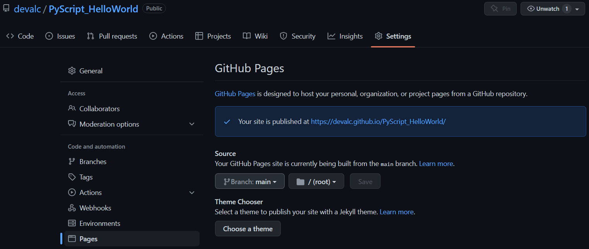

### TL;DR

- Run Python in a browser using PyScript
- Set up Python environment using <py-env> HTML tag
-	Write and run python logic using <py-script> HTML tag
-	Demo visualization page using Pandas, Panel, and Bokeh
- Deploy the demo page using Github Pages (<a href="https://devalc.github.io/PyScript_HelloWorld/">live page here</a>)

#### PyScript: Now you can write and run Python directly in HTML/browser! 👀

Image source: <a href="https://pyscript.net/">PyScript</a>

At the PyCon US 2022, <a href="https://anaconda.cloud/">Anaconda’s</a> CEO Peter Wang revealed a very interesting project - <a href="https://pyscript.net/">PyScript</a>. An approach for writing and running Python code directly in HTML. With a combination of Python and standard HTML, users can now create Python-based applications directly in a browser. While PyScript is still quite new and under active development, I thought of taking it for a spin!

#### Sneak peek at running Python from Browser/ HTML 

In this blog, I demonstrate how to run Python logic in the browser using PyScript. Here I use the <a href="https://www.kaggle.com/datasets/kkhandekar/total-wildfires-acres-affected-1983-2020">Total Wildfires & Acres Affected (1983 - 2020)</a> dataset available on <a href="https://www.kaggle.com">Kaggle</a> and show how it can be loaded to the PyScript environment. Basic data clean up in the Python logic is done using the Pandas library and data visualization is done using the Bokeh library. The final demo HTML page is then deployed as a GitHub Page.

#### Boilerplate HTML code

Here's the boiler plate HTML code used in this example. Most of this is pretty standard. For styling, I have added links to Bootstrap and custom CSS files in the `<head>` tag. In the `<body>` tag, there is a `
` that holds some text and a nested `
` that will hold the four visuals generate by the Python logic. 

#### Let's get to the fun part - PyScript:

To use PyScript, first import the pyscript files to your html page by adding the following code to the `<head>` tag:

Next in the `<head>` tag, specify the packages needed for your Python logic using the `<py-env>` tag. This `<py-env>` tag is where you can also specify the location to the data to be loaded using the `-paths:` tag (Notice the indentation and the `-` when specifying the location to the CSV file). In this case the CSV file is in the same location as the HTML file. 

Once that is done, we can start writing the Python logic inside the special HTML tag called `<py-script>` tag within the `<body>` tag. In this example, all the libraries needed are imported. Then using Pandas, the data is read in, cleaned and some calculations are performed. Then the data is visualized using the Bokeh library. To use Bokeh, following few lines need to be added to the `<head>` of the HTML:

And there you have it! The demo page that visualizes the wildfire dataset by running the Python logic directly in the browser is ready. Here's a screen-shot of what it looks like:

#### Deploying it with GitHub Pages

This page can be then hosted as a GitHub repository and deployed as a GitHub Page. To do this commit all the changes to a GitHub repository for the project. In this case, it's called <a href="https://github.com/devalc/PyScript_HelloWorld">PyScript_HelloWorld</a> and all the code shown in this blog can be found <a href ="https://github.com/devalc/PyScript_HelloWorld/blob/main/index.html">here</a>. 

To deploy the demo html as a GitHub page, first make sure the file is named `index.html`. Then navigate to `settings` page of the repository and select `Pages` from the sidebar. Then select the branch you want to deploy and hit `save`. This will publish the site and provide the link of the deployed page (as shown in the picture below). In this case the page can be found <a href="https://devalc.github.io/PyScript_HelloWorld/">here</a>.

