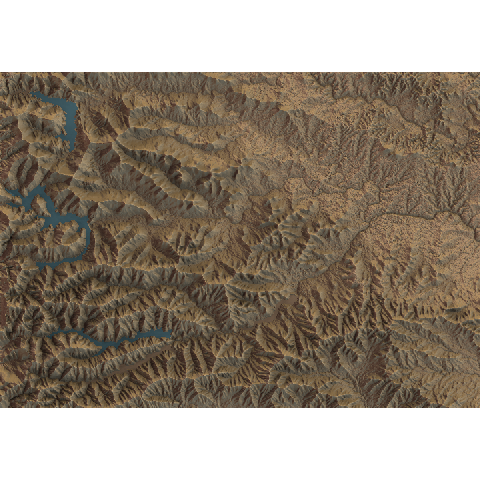
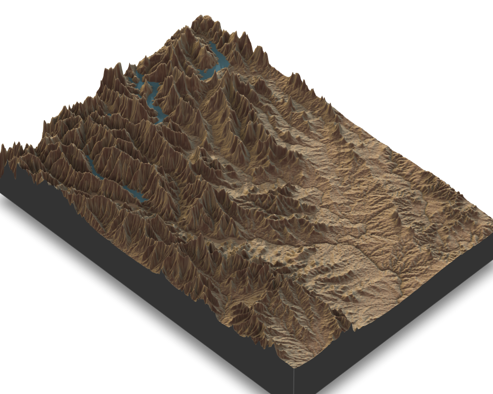
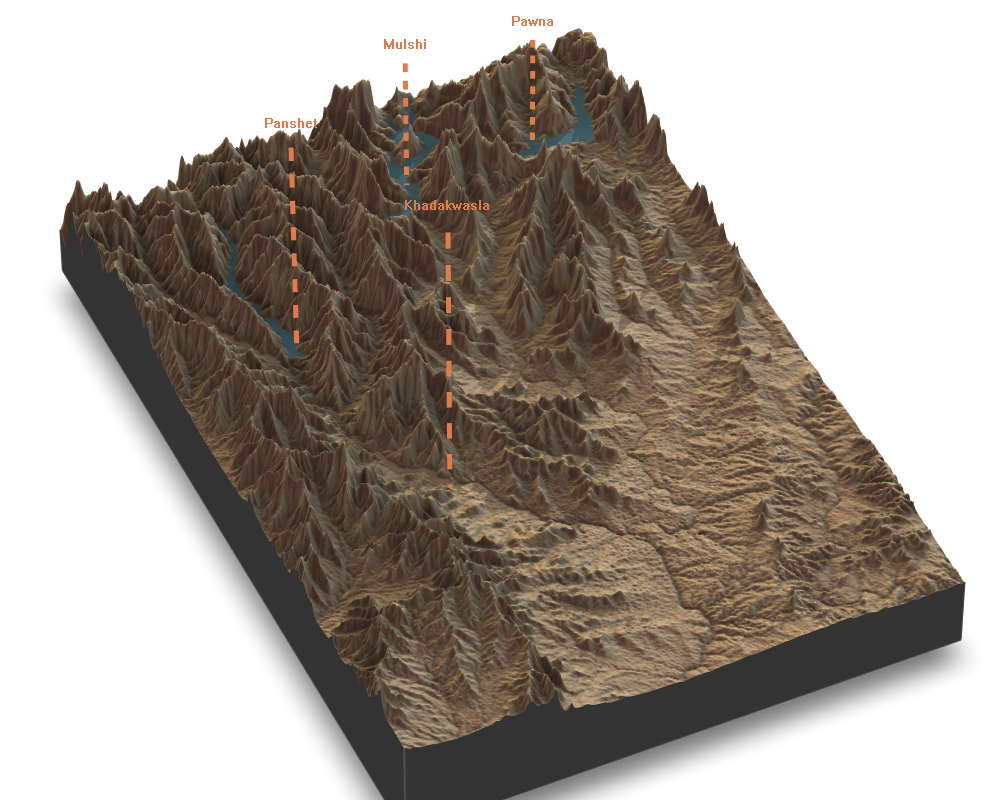

```{r setup, include=FALSE}
knitr::opts_chunk$set(echo = TRUE)
```

```{r xaringanExtra-clipboard, echo=FALSE}
xaringanExtra::use_clipboard()
```

### Impressive 2D/3D plots, using just R? Wait, What?!

Is `#rstats`{=html} a part of your workflow? Do you love creating 2D/3D visuals? Have you always wanted to create amazing 3D visuals like this 👇? 

<video width="700" height="550" controls autoplay>
  <source src="pune.webm" type="video/webm">
</video>

<br/>

Then the <a href="https://www.rayshader.com/">Rayshader</a> package is your friend. Thanks to this package, creating such visuals with R very easy and straight forward.

#### Rayshader

Rayshader is a powerful open-source R package developed by <a href="https://twitter.com/tylermorganwall">Tyler Morgan-Wall</a>. You can learn more about the package <a href="https://www.rayshader.com/"> here</a> and also find a comprehensive documentation of different functions <a href= "https://github.com/tylermorganwall/rayshader"> here </a>. Rayshader simplifies visualizing data in 2D and 3D with amazing levels of details and using just R. Not just that! What amazes me is the ease at which one can customize almost anything in the visual. 

#### Exploring Rayshader  

Let's start exploring some of the functionalities Rayshader has on offer. Here I will use the digital elevation model (DEM) data of my home town in India. Let's jump right in and begin by loading the packages and the DEM layer. This is a gridded raster file. I will also crop it to the bounding box that I am interested in.

```{r, warning=FALSE, message=FALSE}
# pacakges we will need
library(raster)
library(rayshader)
library(tidyverse)
library(leaflet)

# import data
data  = raster::raster("D:/GitHub/MyContributions_to_30DayMapChallenge/11_3d/data/srtm_51_09.tif")

# define bounding box
e = extent(c(xmax = 73.4, xmin = 74, ymin = 18.3, ymax = 18.72))

# clip raster to the bounding box
data = crop(data,e)
```

<br/>
Here's a quick look at the data: 

```{r, warning=FALSE, message=FALSE}
# define color palette
pal = leaflet::colorNumeric(palette ="inferno", values(data),
  na.color = "transparent")

# plot raster layer
leaflet() %>% addTiles() %>%
  addRasterImage(data, colors = pal, opacity = 0.6) %>%
  addLegend(pal = pal, values = values(data),
    title = "elevation (m)")
```

#### 2D mapping

Now, lets convert this data into a 2D matrix using the `raster_to_matrix` function from Rayshader package.

```{r, warning=FALSE, message=FALSE}
data_matrix = rayshader::raster_to_matrix(data)
```

Generate 2D map using the code below:


```{r, eval=FALSE, warning=FALSE, message=FALSE}
data_matrix%>%
  rayshader::sphere_shade(texture = "desert", sunangle = 90) %>%
  rayshader::add_water(rayshader::detect_water(data_matrix), color = "imhof4") %>%
  rayshader::add_shadow(rayshader::ray_shade(data_matrix), 0.5) %>%
  rayshader::add_shadow(rayshader::ambient_shade(data_matrix), 0) %>%
  rayshader::plot_map()

```
<p>
   
</p>

The `detect_water` and `add_water` functions detect and add the water layers to the plot. We can even shift around the sun direction using the `sunangle` argument in the `sphere_shade` function. The `ray_shade` function creates ray-traced lighting layer from a given sun angle and the `ambient_shade` function models and adds the lighting layer as a result of atmospheric scattering. 


#### 3D mapping

Generate 3D map using the code below:

```{r, eval=FALSE, warning=FALSE, message=FALSE}
data_matrix%>%
  rayshader::sphere_shade(texture = "desert") %>%
  rayshader::add_water(rayshader::detect_water(data_matrix), color = "imhof4") %>%
  rayshader::add_shadow(rayshader::ray_shade(data_matrix, zscale = 3), 0.5) %>%
  rayshader::add_shadow(rayshader::ambient_shade(data_matrix), 0) %>%
  rayshader::plot_3d(data_matrix, zscale = 10, fov = 10, theta = 45, zoom = .65, phi = 45,
          windowsize = c(1000, 800))
Sys.sleep(0.2)

# save snapshot to a file
render_snapshot("3d_snap.png")
```
<p>
   
</p>

##### Adding labels

What if you wanted to add labels on this map? That is easy too. you can use the `render_label` function to add labels as shown below:

```{r, eval=FALSE, warning=FALSE, message=FALSE}
data_matrix%>%
  rayshader::sphere_shade(texture = "desert") %>%
  rayshader::add_water(rayshader::detect_water(data_matrix), color = "imhof4") %>%
  rayshader::add_shadow(rayshader::ray_shade(data_matrix, zscale = 3), 0.5) %>%
  rayshader::add_shadow(rayshader::ambient_shade(data_matrix), 0) %>%
  rayshader::plot_3d(data_matrix, zscale = 10, fov = 10, theta = 65, zoom = .65, phi = 45,
          windowsize = c(1000, 800))
 render_label(data_matrix, x = 450, y = 340, z = 18000, zscale = 50,
             text = "Khadakwasla", textsize = 2, linewidth = 5, freetype = FALSE,
             linecolor = "#df7c4d",
             textcolor = "#df7c4d",
             dashed = TRUE)
 render_label(data_matrix, x = 250, y = 390, z = 15000, zscale = 50,
              text = "Panshet", textsize = 2, linewidth = 5, freetype = FALSE,
              linecolor = "#df7c4d",
              textcolor = "#df7c4d",
              dashed = TRUE)
 render_label(data_matrix, x = 100, y = 220, z = 10000, zscale = 50,
              text = "Mulshi", textsize = 2, linewidth = 5, freetype = FALSE,
              linecolor = "#df7c4d",
              textcolor = "#df7c4d",
              dashed = TRUE)
 render_label(data_matrix, x = 100, y = 100, z = 9000, zscale = 50,
              text = "Pawna", textsize = 2, linewidth = 5, freetype = FALSE,
              linecolor = "#df7c4d",
              textcolor = "#df7c4d",
              dashed = TRUE)
Sys.sleep(0.2)

# save snapshot to a file
render_snapshot("3d_snap_with_labels_featured.png")

```
<p>
   
</p>

#### Exporting a movie

This is how you can save the rendered 3D frames as a movie like the one displayed at the beginning of this blog:

```{r,eval= FALSE, warning=FALSE, message=FALSE}
data_matrix%>%
  rayshader::sphere_shade(texture = "desert") %>%
  rayshader::add_water(rayshader::detect_water(data_matrix), color = "imhof4") %>%
  rayshader::add_shadow(rayshader::ray_shade(data_matrix, zscale = 3), 0.5) %>%
  rayshader::add_shadow(rayshader::ambient_shade(data_matrix), 0) %>%
  rayshader::plot_3d(data_matrix, zscale = 10, fov = 10, theta = 65, zoom = .65, phi = 45,
          windowsize = c(1000, 800))
 render_label(data_matrix, x = 450, y = 340, z = 18000, zscale = 50,
             text = "Khadakwasla", textsize = 2, linewidth = 5, freetype = FALSE,
             linecolor = "#df7c4d",
             textcolor = "#df7c4d",
             dashed = TRUE)
 render_label(data_matrix, x = 250, y = 390, z = 15000, zscale = 50,
              text = "Panshet", textsize = 2, linewidth = 5, freetype = FALSE,
              linecolor = "#df7c4d",
              textcolor = "#df7c4d",
              dashed = TRUE)
 render_label(data_matrix, x = 100, y = 220, z = 10000, zscale = 50,
              text = "Mulshi", textsize = 2, linewidth = 5, freetype = FALSE,
              linecolor = "#df7c4d",
              textcolor = "#df7c4d",
              dashed = TRUE)
 render_label(data_matrix, x = 100, y = 100, z = 9000, zscale = 50,
              text = "Pawna", textsize = 2, linewidth = 5, freetype = FALSE,
              linecolor = "#df7c4d",
              textcolor = "#df7c4d",
              dashed = TRUE)
render_snapshot()

angles= seq(0,360,length.out = 1441)[-1]
for(i in 1:1440) {
  render_camera(theta=-45+angles[i])
  render_snapshot(filename = sprintf("pune%i.png", i))
}
rgl::rgl.close()


system("ffmpeg -framerate 60 -s 1920x1080 -i pune%d.png -pix_fmt yuv420p pune_new.mp4")


```