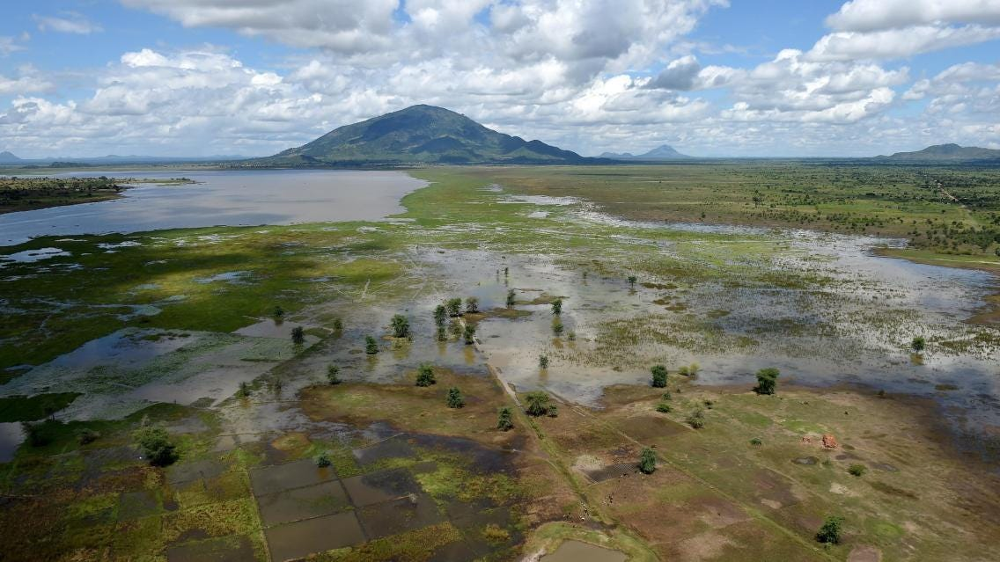
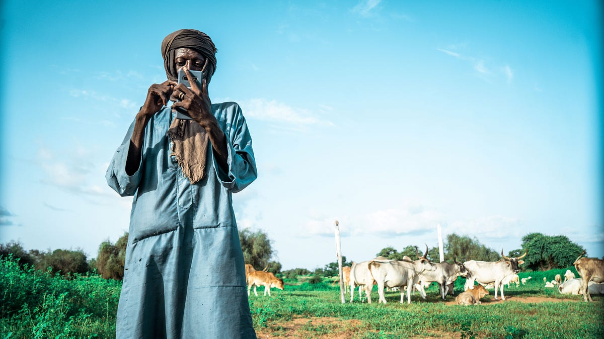
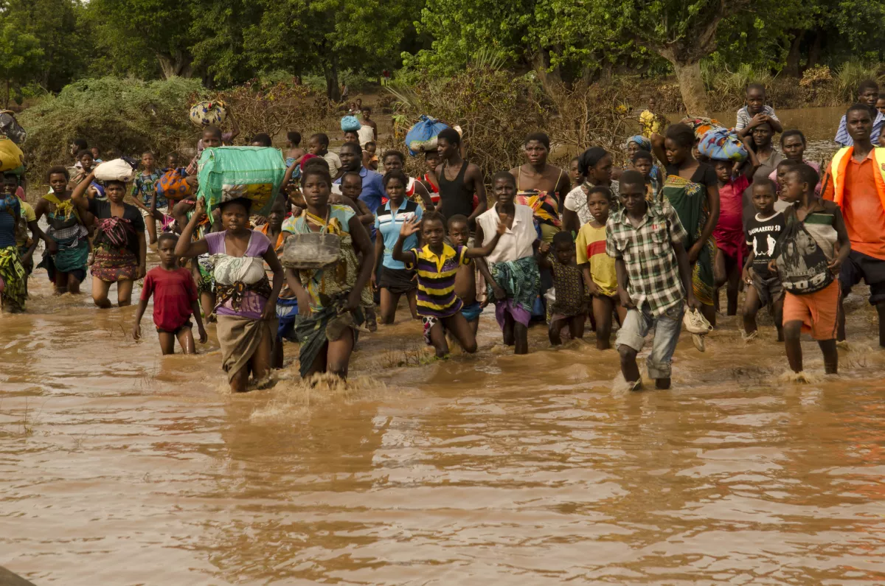
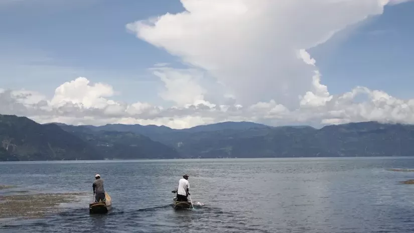

*Photo credit: Government of South Africa/DIRCO*

As the world grapples with water scarcity, deteriorating water quality, and increasingly frequent extreme weather events, the importance of timely and accurate Earth observation data in decision-making cannot be overstated.

Imagine this: there’s a huge storm brewing out at sea and advancing towards land. But there are no satellites that are observing the Earth and collecting the data that is needed to inform communities of the impending disaster. How would at-risk communities prepare or respond to impending floods? Without timely early warning data, vulnerable people would be caught off guard when the storm strikes.

Beyond disasters, we still increasingly rely on water data for our day-to-day lives. Water data can help farmers know how much groundwater is available to them, it can help pastoralists guide their herds to water bodies, and it can help communities know if their water is safe to drink.

Disaster preparedness and the water resource management require reliable and timely information. In many regions of the world, ground observation data is scarce. For example, a country might have limited access to local weather stations or gauges to measure the water level of a river. Even if this data is available, there may be gaps in coverage, both in terms of geography and historical record. This also reduces the ability of local communities to make proactive, informed water-related decisions. Earth observation data, coupled with sophisticated models, can bridge this gap as a crucial source of information, especially in data-scarce regions.

Here are three ways that SERVIR’s innovative services and tools enable decision-makers and authorities to address water challenges:

## When water is scarce: locating water during the dry season

*Photo credit: CSE*

In the vast Ferlo region of north-central Senegal, dry savannah dominates and pastoralism is central to local livelihoods. The dry season in this region can last up to nine months, which means that finding water is critical for sustaining livestock. Traditional reliance on historical knowledge to locate water sources during the dry season has become less dependable due to shifting weather patterns. To address this challenge, SERVIR West Africa and Senegal’s Center for Ecological Monitoring (CSE) developed a service that uses satellite imagery from NASA and the European Space Agency to detect seasonal watering holes. This information is broadcasted via text and radio, which herders can use to direct their livestock to water.

## When there is too much water: flood early warning systems

*Photo credit: Arjan van de Merwe/UNDP*

The devastating impact of Cyclone Idai that hit East Africa in 2019 underscored the critical need for robust early warning systems in Malawi. The absence of adequate weather forecasting and alert systems exacerbated the disaster, resulting in 1,500 deaths and 2,300 missing persons. In response, Malawi’s government collaborated with SERVIR to boost its flood warning systems, creating the Community-Based Flood Early Warning System (CBFEWS).

Led by SERVIR-supported scientists in the region, CBFEWS extended local flood warning time from only a few hours to days. When two large cyclones struck Malawi in 2022, these flood warnings saved the country an estimated $40 million in losses. With the support of various international organizations, including the United Nations Development Programme (UNDP) and the World Bank, CBFEWS is now set to expand to cover all of Malawi. Through collaborative climate adaptation efforts, water Earth observation data can save lives and protect livelihoods in flood-prone areas.

## When water quality is unsafe: monitoring algal blooms

*Photo Credit: SERVIR/Africa Flores*

Lake Atitlán in Guatemala is celebrated as one of the world’s beautiful lakes. It also faces significant threats, particularly from massive algal blooms. An algal bloom can kill off the plants and animals that live in water and lead to the growth of toxic bacteria, threatening local drinking water supplies. With the support of SERVIR, lake managers now employ the Lake Atitlán Forecasting System, a web tool that uses NASA Earth Science data to predict the necessary conditions for algal blooms, such as weather and water runoff forecasts. These predictions are used to trigger on-the-ground water quality testing for timely interventions. This forecasting that combines space-based data with local water sampling is crucial for safeguarding the lake’s ecology and the communities that rely on it.

*Originally published at https://servirglobal.net on March 22, 2024.*