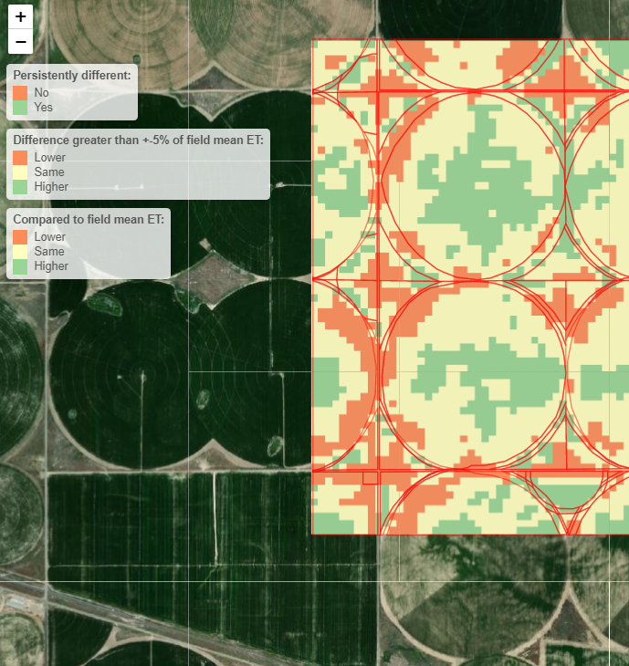

***
Many growers now have the ability to adopt variable rate management strategies to optimize crop performance and profitability within a specific field. But targeting those managements is challenging. Using historic satellite remote sensing evapotranspiration imagery this tool helps identify fields that could potentially benefit from variable rate management strategies. It provides pre-processed interactive maps that show the proportion of the field which either consistently under-performs or over-performs relative to the field average.

  

We used historic 30 m gridded seasonal consumptive irrigation requirement maps (i.e. actual evapotranspiration or crop water uptake) developed by the University of Idaho and the Idaho Department of Water Resources over an 11 year period to identify fields that demonstrate consistent crop performance patterns. Each year we calculated relative crop water use for each pixel (relative to the field mean). A value of 1 indicates the specific point in a field responds similarly to the average for the entire field.  Hypothesis testing using this relative crop water use maps for each pixel in the field we determine whether the relative crop water use over the 11 years was statistically different than the field average at a 95% confidence interval.  

In some cases, a grower might be more conservative and would like to define a portion of a field as performing persistently different based on a specific threshold. To address this concern we also created maps the identified the portion of a field where the relative crop water use was greater than 5% different than the field average
