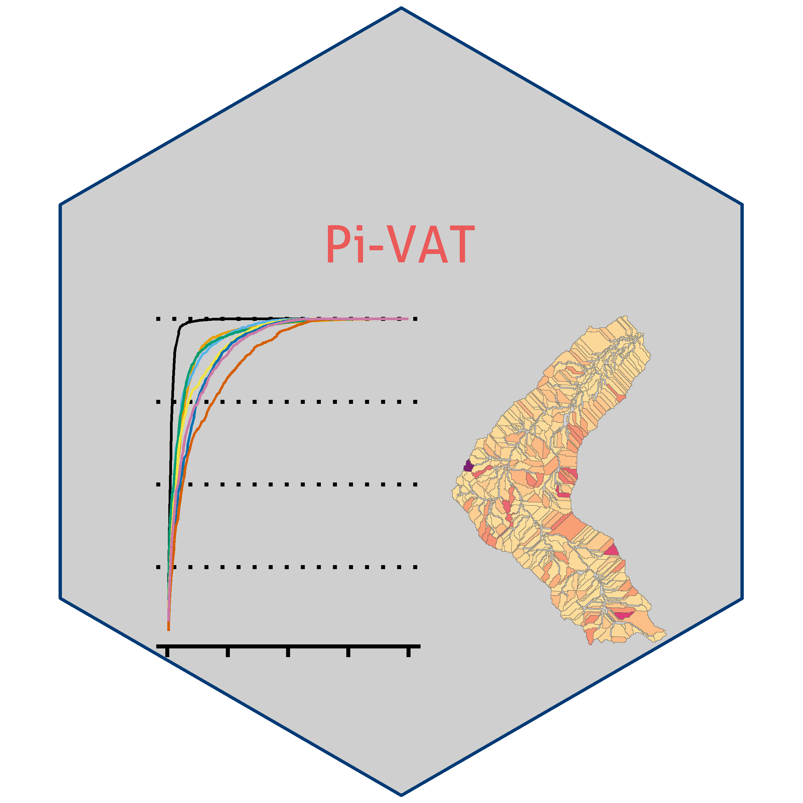

***

  

This is a post-processing, interactive visualization, and analysis tool (Pi-VAT). It is an interactive tool for synthesis and decision support using multi-watershed, multi-scenario outputs from complex, geo-spatial water quality models. It is currently programmed to process outptus from two models:

- Online interface ([WEPPcloud](<https://wepp.cloud/weppcloud/>)) for the Watershed Erosion Prediction Project (WEPP) 
- Soil and Water Assessment Tool ([SWAT](<https://swat.tamu.edu/>)). 

Based on the multi-watershed, multi-scenario simulations from these models this tool facilitates interactive identification of sources areas and hotpots of the water quality metric of concern and areas that are suitable for targeted management. For these areas the tool also facilitates comparative analysis by quantifying and visualizing differences between different scenarios.  

