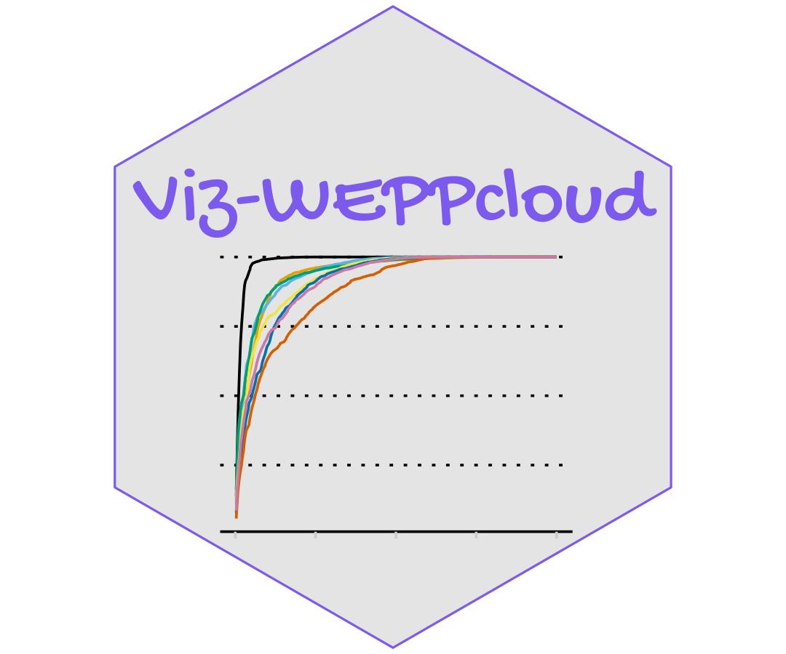

***

  

A Shiny web application that is a post-processing, interactive tool based on the simulations from the WEPPcloud interface and can be used to identify erosion hotspots and hillslopes that are suitable for targeted management.

At present it has the capability to get WEPPCloud generated hillslope, channel and watershed summary output files and post-processes them in the back end and perform visualizations both (spatial and non spatial plots) based on the user selected variables.

