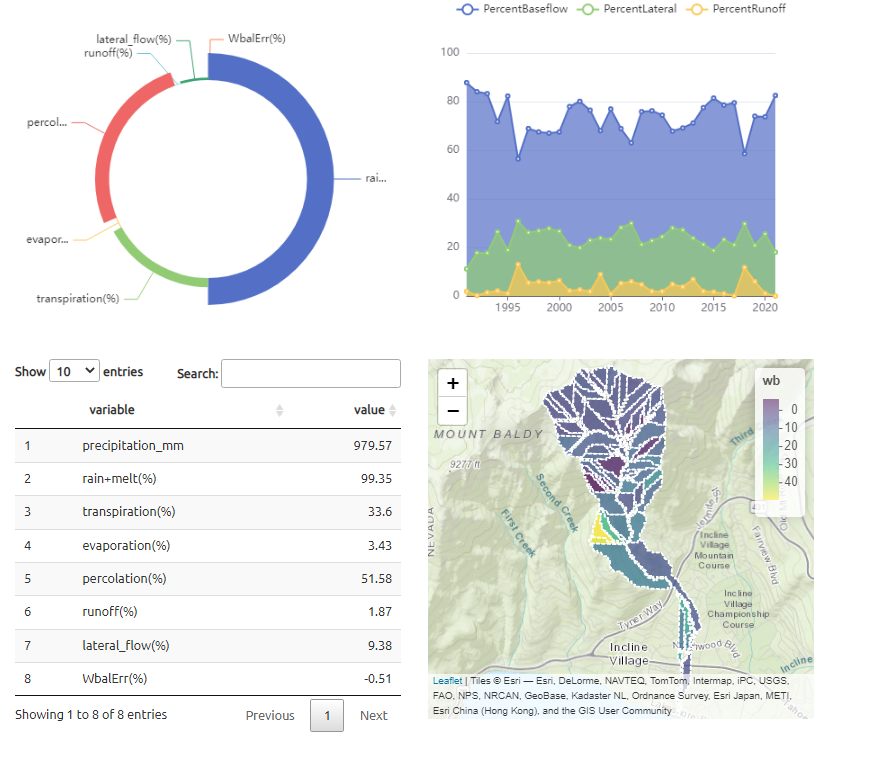

This is a Shiny application bundled into an R package for internal use in my current working group. It is still under development but the beta version will be released soon. It is aimed at quick and interactive synthesis of WEPP model runs executed on WEPPcloud. All one needs is a WEPPcloud project URL and the simulation start and end date. 

  

